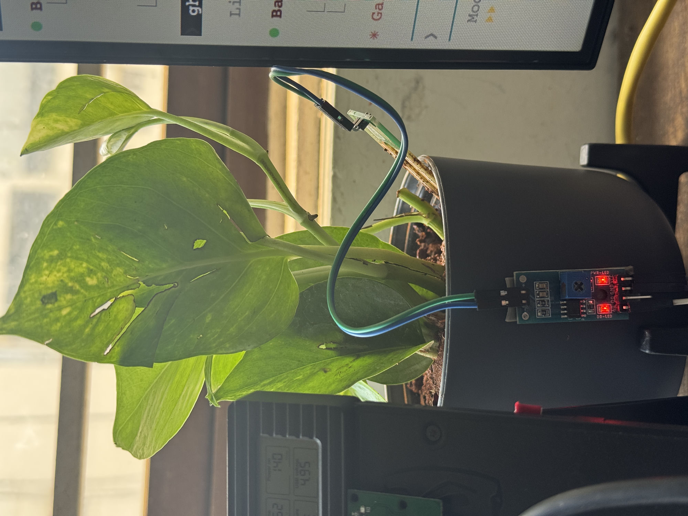
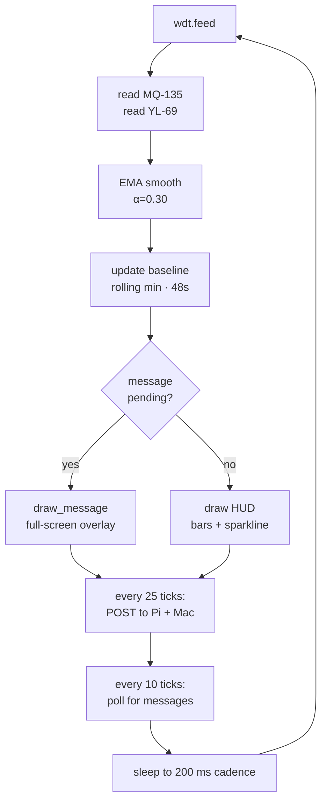

```
 ╔══════════════════════════════════════════════════════════════╗
 ║                                                              ║
 ║   E S P 3 2 - T E C H - H U D                                ║
 ║                                                              ║
 ║   a 128×64 OLED dashboard for plants, air, and you           ║
 ║                                                              ║
 ╚══════════════════════════════════════════════════════════════╝
```


> A self-contained environmental monitor on an ESP32-S3 dev board. Reads air-quality (MQ-135) and soil moisture (YL-69), renders a real-time "tech HUD" on a tiny mono OLED, and POSTs telemetry to a Raspberry Pi + a Mac for graphing. Survives hangs via a hardware watchdog and shows a boot splash within 100 ms of power-on.

---

## The setup, in the wild



That's the YL-69 probe buried in a pothos that lives next to my monitor. Comparator module pinned to the side of the pot (red PWR-LED on the right). AO goes back to GPIO 5 on the ESP32 sitting under the desk.

---

## The display

The whole UX is **128 pixels wide × 64 pixels tall, single-color**. Everything you see below is rendered from a single MicroPython script using only the built-in 8×8 monospace font + lines + rectangles.

```
 ┌──────────────────────────────────────────┐
 │[AIR] CLN  0.55V          ●  #042         │  ← inverted-pill label, category, voltage, blink dot, status
 │══════════════════════════════════════════│  ← double rule
 │ A┤▰▰▰▰▱▱▱▱▱▱▱▱▱▱▱▱▱▱▱├ 030               │  ← AIR index 0–100, fuel-gauge bar
 │ S┤▰▰▰▰▰▰▰▰▰▰▰▰▰▱▱▱▱▱▱├ 073               │  ← SOIL moisture 0–100, fuel-gauge bar
 │──────────────────────────────────────────│  ← single rule
 │ #042                              1.20   │  ← status + sparkline hi label
 │       ╱╲___╱─╲___─╱╲____╱╲___            │
 │      ╱                                   │  ← 128-sample voltage history
 │  ___╱                              0.30  │  ← sparkline lo label
 └──────────────────────────────────────────┘
```

When the Pi sends a message via [`pi-display`](#hermes--whatsapp-integration), the whole screen takes over with the message body in big or small font depending on length, plus a 60-second TTL bar at the top.

---

## Architecture

```mermaid
flowchart LR
    subgraph ESP["ESP32-S3"]
        MQ[MQ-135<br/>GPIO 4 ADC]
        SOIL[YL-69<br/>GPIO 5 ADC]
        OLED[SSD1306 OLED<br/>I²C 0x3C]
        MAIN[main.py loop<br/>5 Hz · WDT 15s]
    end

    PI[Raspberry Pi<br/>weather-web :8000]
    MAC[Mac dashboard<br/>plant-happy :3020]
    HER[Hermes Agent<br/>Honey persona]
    WAPP[WhatsApp]

    MQ --> MAIN
    SOIL --> MAIN
    MAIN --> OLED
    MAIN -->|POST /api/mq every 5s| PI
    MAIN -->|POST /api/ingest every 5s| MAC
    WAPP --> HER
    HER -->|pi-display "text"| PI
    PI -.GET /api/oled_msg.-> MAIN
```

---

## Hardware

| Component | Part | Pin | Notes |
|---|---|---|---|
| MCU | ESP32-S3R2 dev board | — | 8 MB flash, 2 MB PSRAM, WCH CH343 USB-UART |
| Display | SSD1306 128×64 OLED | SDA=10, SCL=11 | I²C @ 400 kHz, address `0x3C` |
| Air sensor | MQ-135 VOC | GPIO 4 (ADC1_CH3) | `ATTN_11DB`, 3V3 power |
| Soil sensor | YL-69 4-pin resistive | GPIO 5 (ADC1_CH4) | `ATTN_11DB`, AO only |
| WiFi | onboard 2.4 GHz | — | joins SSID at boot via `boot.py` |

### Pinout

```
                 ╭───── ESP32-S3 ─────╮
   MQ-135  AO ──→│ GPIO 4              │
   YL-69   AO ──→│ GPIO 5              │
   OLED   SDA ←─→│ GPIO 10             │
   OLED   SCL ←─→│ GPIO 11             │
            3V3 →│ → MQ VCC, OLED VCC  │
            GND  │ → all GNDs          │
                 ╰─────────────────────╯
```

> **Heads up:** the dev board's labeled `5V` pin is dead on this board (verified twice). Pull 5V from another supply if a peripheral needs it.

---

## Software

### Files

| File | Role |
|---|---|
| [`boot.py`](boot.py) | WiFi connect with retry. Lights the OLED with a `BOOT / WiFi:Pi2.4 / connecting…` splash within 100 ms of power-on. |
| [`main.py`](main.py) | The dashboard loop. Reads sensors, smooths with EMA, renders the HUD, POSTs telemetry, polls for incoming messages. WDT-guarded. |
| [`smoke_test.py`](smoke_test.py) | 60-second standalone OLED + MQ-135 graph used during bring-up. |
| [`lcd/`](lcd) | Earlier abandoned attempt at driving an HD44780 16×2 LCD via a PCF8574 backpack — kept for reference. |

### The loop



### Resilience: how the OLED stays alive forever

Two safeguards keep the screen from ever freezing:

1. **Hardware watchdog** — `WDT(timeout=15000)` in `main.py`. If the loop hangs >15s for any reason (broken POST, network deadlock, parse error in a hot path), the chip hard-resets. Long enough to absorb a slow HTTP timeout, short enough that no user-visible freeze lasts.
2. **Boot splash in `boot.py`** — initialises the OLED *before* WiFi, so a `BOOT / WiFi:Pi2.4 / connecting…` panel is on screen within ~100 ms of power-on. After WDT reset, the user sees the splash returning instead of a dark screen.

The main loop also wraps the entire body in `try / except Exception` (with `KeyboardInterrupt` re-raised so `mpremote` REPL takeover still works) and increments an on-screen `C###` crash counter so a buggy render path can't silently kill the network heartbeat.

---

## The two endpoints it talks to

### 1. Pi air-quality endpoint

Every 5 s, `main.py` does:

```http
POST http://<pi>:8000/api/mq
Content-Type: application/json

{"voc_raw": 36041, "voc_mv": 1814.7, "voc_index": 32.4}
```

The Pi rolls these into a 24h history file and renders them as inline-SVG sparklines on its own dashboard.

### 2. Mac plant endpoint

Every 5 s (offset 2.4 s from the Pi POST so they don't collide):

```http
POST http://<mac>:3020/api/ingest
Content-Type: application/json

{"plant_id": "monstera-1", "soil_raw": 22210, "soil_pct": 98.5}
```

### 3. Inbound message overlay

Every 2 s:

```http
GET http://<pi>:8000/api/oled_msg
→ {"message": "tea is ready", "ttl": 47.2}
```

If a message comes back, the HUD is replaced with a full-screen message panel for the TTL. Wired up to a `pi-display "text"` shell helper on the Pi, which in turn is exposed to the Nous Hermes Agent ("Honey" persona) and reachable from WhatsApp.

---

## Setup

### Flash MicroPython

```bash
esptool.py --chip esp32s3 --port /dev/cu.usbmodem* erase_flash
esptool.py --chip esp32s3 --port /dev/cu.usbmodem* write_flash 0 ESP32_GENERIC_S3-v1.28.0.bin
```

### Install the OLED driver on-device

```bash
mpremote connect auto mip install ssd1306
```

### Edit WiFi credentials

In `boot.py`, set `SSID` and `PASS`.

### Push the files

```bash
mpremote connect auto cp boot.py :boot.py
mpremote connect auto cp main.py :main.py
mpremote connect auto reset
```

The OLED should light up with a splash within ~100 ms, connect to WiFi within ~5 s, then drop into the live HUD.

---

## Calibration

The soil sensor needs two-point calibration. Read raw values with the probe in two states and set them in `main.py`:

```python
SOIL_DRY_RAW = 65000   # probe in air or fully dry soil
SOIL_WET_RAW = 22000   # probe in a freshly-watered plant
```

The dashboard linearly maps raw → 0–100 % between these two anchors (clamped).

To re-calibrate live:

```bash
mpremote connect auto exec "
from machine import Pin, ADC
import time
soil = ADC(Pin(5), atten=ADC.ATTN_11DB)
for _ in range(10):
    raw = sum(soil.read_u16() for _ in range(16)) // 16
    print('raw=', raw)
    time.sleep(0.5)
"
```

Lower raw = wetter.

---

## Hermes / WhatsApp integration

The Pi runs the [Nous Hermes Agent](https://github.com/NousResearch/hermes-agent) bridged to WhatsApp. Its persona file (`~/.hermes/SOUL.md`) documents a `pi-display "text"` shell command. The flow:

1. You message Honey from WhatsApp: *"flash 'tea is ready' on the screen"*.
2. Honey invokes the shell tool: `pi-display "tea is ready"`.
3. `pi-display` writes the message + a 60-second TTL into `/tmp/pi_oled_msg`.
4. A Pi HTTP handler exposes it at `/api/oled_msg`.
5. The ESP32 polls that endpoint every 2 s, gets the message, and renders it full-screen until the TTL expires.

The HUD then resumes automatically.

---

## License

MIT — see [LICENSE](LICENSE).

---

```
                    ┌─────────────────────────┐
                    │  built on a tiny board, │
                    │  pushing tiny pixels    │
                    └─────────────────────────┘
```
